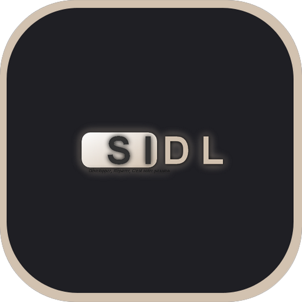

## SIDL CORPORATION

  

<h1 align="center">
  SIDL CORPORATION
</h1>

  L'application, à regrouper plusieurs informations sur l'entreprise, ainsi que le site internet, et les applications éditer par l'entreprise.

  
  
  
  

***
## ACUTALITÉS SUR LES MISES à JOURS :
### Actualités via Twitter.

<blockquote class="twitter-tweet" data-theme="dark">
La mise à jour va donc êtres très prochainement disponible vers la version 1.2001.2023.0
&mdash; SIDL CORPORATION (@SIDLCORPORATION) <a href="https://twitter.com/SIDLCORPORATION/status/1615879082020945920?ref_src=twsrc%5Etfw">19 janvier 2023</a></blockquote>

<blockquote class="twitter-tweet" data-lang="fr" data-theme="dark">
Des retards lors du lancement de la mises à jour seras donc à prévoir... <a href="https://t.co/HJU3iw154T">https://t.co/HJU3iw154T</a>
&mdash; SIDL CORPORATION (@SIDLCORPORATION) <a href="https://twitter.com/SIDLCORPORATION/status/1615826951402590209?ref_src=twsrc%5Etfw">18 janvier 2023</a></blockquote>

<blockquote class="twitter-tweet" data-theme="dark">
La mise à jour qui devais arriver de notre application, et actuellement retarder pour une erreur lors du développement. Nous allons donc corriger le problème et tenter de tester si ça viens de l&#39;ajouts de l&#39;audio.
&mdash; SIDL CORPORATION (@SIDLCORPORATION) <a href="https://twitter.com/SIDLCORPORATION/status/1615825905405886465?ref_src=twsrc%5Etfw">18 Janvier 2023</a></blockquote>

## LES DERNIÈRES MISES À JOURS / VERSIONS :

 <h3> APPLICATION WINDOWS</h3>

  
 
  
  
  | Status | Type | Sortie le | Mise à jour | Version | Nom de l'application | Nouveautés dans la version |
  |:-:|:-:|:-:|:-:|:-:|:-:|:-:|
  | 🟠 |  | 13/12/2023 | 20/01/2023 | 1.2001.2023.0 | SIDL CORPORATION | <a href="https://github.com/SIDL-C0R0RATI0N/SIDL-CORPORATION/blob/main/CHANGELOG.md#version-1200120230---20-janvier-2023" target="_blank">Lire ici</a> |
  | 🟢 |  | 13/12/2023 | NaN | 1.1301.2023.0 | SIDL CORPORATION | <a href="https://github.com/SIDL-C0R0RATI0N/SIDL-CORPORATION/blob/main/CHANGELOG.md#version-1130120230---13-janvier-2023" target="_blank">Lire ici</a> |

  

🔁 PROCHAINE MISES À JOURS

    

   | Status | Version | Date | Plateform | Nom de l'application |
   |:-:|:-:|:-:|:-:|:-:|
   | 🟠 | 1.2001.2023.0 | 20/01/2023 |  | SIDL CORPORATION |
   | 🔴 | 1.1302.2023.0 | 13/02/2023 |  | SIDL CORPORATION |
   | 🔴 | 1.2002.2023.0 | 20/02/2023 |  | SIDL CORPORATION |
   | 🔴 | 1.1303.2023.0 | 13/03/2023 |  | SIDL CORPORATION |
   | 🔴 | 1.2003.2023.0 | 20/03/2023 |  | SIDL CORPORATION |
   | 🔴 | 1.1304.2023.0 | 13/04/2023 |  | SIDL CORPORATION |
   | 🔴 | 1.2004.2023.0 | 20/04/2023 |  | SIDL CORPORATION |
   | 🔴 | 1.1305.2023.0 | 13/05/2023 |  | SIDL CORPORATION |
   | 🔴 | 1.2005.2023.0 | 20/05/2023 |  | SIDL CORPORATION |
   | 🔴 | 1.1306.2023.0 | 13/06/2023 |  | SIDL CORPORATION |
   | 🔴 | 1.2006.2023.0 | 20/06/2023 |  | SIDL CORPORATION |
   | 🔴 | 1.1307.2023.0 | 13/07/2023 |  | SIDL CORPORATION |
   | 🔴 | 1.2007.2023.0 | 20/07/2023 |  | SIDL CORPORATION |
   | 🔴 | 1.1308.2023.0 | 13/08/2023 |  | SIDL CORPORATION |
   | 🔴 | 1.2008.2023.0 | 20/08/2023 |  | SIDL CORPORATION |
   | 🔴 | 1.1309.2023.0 | 13/09/2023 |  | SIDL CORPORATION |
   | 🔴 | 1.2009.2023.0 | 20/09/2023 |  | SIDL CORPORATION |
   | 🔴 | 1.1310.2023.0 | 13/10/2023 |  | SIDL CORPORATION |
   | 🔴 | 1.2010.2023.0 | 20/10/2023 |  | SIDL CORPORATION |
   | 🔴 | 1.1311.2023.0 | 13/11/2023 |  | SIDL CORPORATION |
   | 🔴 | 1.2011.2023.0 | 20/11/2023 |  | SIDL CORPORATION |
   | 🔴 | 1.1312.2023.0 | 13/12/2023 |  | SIDL CORPORATION |
   | 🔴 | 1.2012.2023.0 | 20/12/2023 |  | SIDL CORPORATION |
   | 🔴 | 2.1501.2024.0 | 15/01/2024 |  | SIDL CORPORATION (Version Anniversaire) |
   | 🔴 | 2.2001.2024.0 | 20/01/2024 |  | SIDL CORPORATION (Version Anniversaire) |
   | 🔴 | 2.1502.2024.0 | 15/02/2024 |  | SIDL CORPORATION |
  

👨‍💻 TESTER LES PROCHAINES VERSIONS

  

  | Status | Type de version | Version | Nom de l'application | Plateform | Inscription Bêta/Testeur |
  | ------ | --------------- | ------- | -------------------- | --------- | ------------------------ |
  | 🔴 |  | 1.2001.2023.0 | SIDL CORPORATION (Preview) |  | <a target="_blank" href="mailto:developers@sidl-corporation.fr?subject=Demande%20pour%20tester%20la%20version%20PREVIEW%20de%20SociaLink&body=Bonjour%2C%0A%0AJe%20souhaiterais%20obtenir%20la%20version%20PREVIEW%20de%20l'application%20SociaLink%2C%20dont%20voici%20mes%20informations%20ci-dessous%20%3A%20%0A%0AEmail%20compte%20Microsoft%20%3A%20%0ALangue%20%3A%20%0APays%20%3A%20%0A%0AJ'ai%20ainsi%20conscience%20que%20mes%20informations%20ne%20seront%20en%20aucun%20cas%20publi%C3%A9%20sur%20le%20net%2C%20mes%20seulement%20pour%20obtenir%20la%20version%20PREVIEW%20de%20l'application.">S'INSCRIRE MAINTENANT</a> |

  > **Warning**
  > Sachez que si vous souhaitez tester la version _**PREVIEW**_, vous devez vous inscrire à partir d'un lien dédier car la version _**PREVIEW**_ n'est pas disponible    au publique.
  

ℹ INFORMATIONS

  

  🟢 = Disponible | 🟠 = En développement | 🔴 = Indisponible
  

  

## CONFIGURATION REQUISE :

  |            | Minimum | Recommandé |
  | ---------- | ------- | ---------- |
  | Plateforme | PC | PC |
  | OS | Windows 10* | Windows 10 / Windows 11² |
  | Architecture | X86 / X64 | X86, X64, ARM64 |
  | Clavier intégrée | ❌ | ❌ |
  | Souris | ✅ | ✅ |
  | DirectX | Version 9 | Version 11 |
  | Mémoire | Non Spécifié | 12 Go |
  | Mémoire vidéo | Non Spécifié | 6 Go |
  | Interaction tactile | Non Spécifié | Non Spécifié |
  | Processeur | Non Spécifié | Non Spécifié |
  | Processeur graphique | Non Spécifié | Non Spécifié |

                                                                                             
  

ℹ INFORMATIONS SUPPLÉMENTAIRES

  

  ## INFORMATIONS SUPPLÉMENTAIRES

  | Développé par | <a target="_blank" href="https://sidl-corporation.fr/">SIDL CORPORATION</a> |
  |:-:|:-:|
  | Publié par | <a target="_blank" href="https://apps.microsoft.com/store/search?publisher=SIDL%20CORPORATION">SIDL CORPORATION</a> |
  | Date de sortie | 13/01/2023 |
  | Mise à jour | NaN |
  | Catégorie | Productivité |
  | Taille approximative | 46,4 Mo |
  | Langues prises en charge | Anglais, Français |
  | Version | 1.1301.2023.0 |

  

  

                                                                                             
  

ℹ INFORMATIONS

  

  > (* : Windows 10 version 18362.0 ou supérieure). 
  > (² : L'application peut-être compatible sur Windows 11, mes jamais testé par le développeur). 
  

  

  
## DESCRIPTION :

Vous souhaitez avoir des informations sur l'entreprise "SIDL CORPORATION", Découvrir ainsi les applications éditer par l'entreprise ou encore, accéder au site internet officiel de l'entreprise, c'est maintenant possible.

## CAPTURE(S) D'ÉCRAN :

  
  
  
  
  

## DÉPENDANCES UTILISER DANS L'APPLICATION :

- <a href="https://github.com/CommunityToolkit/WindowsCommunityToolkit/blob/main/License.md" target="_blank">Microsoft Toolkit MVVM</a>
- <a href="https://learn.microsoft.com/fr-fr/windows/apps/winui/winui2/license" target="_blank">Windows UI Library</a>
- <a href="https://raw.githubusercontent.com/JamesNK/Newtonsoft.Json/master/LICENSE.md" target="_blank">Newtonsoft.Json</a>
- <a href="https://www.microsoft.com/en-us/legal/intellectualproperty/copyright" target="_blank">Microsoft.Services.Store.SDK</a>
- <a href="https://raw.githubusercontent.com/Microsoft/AdaptiveCards/master/LICENSE" target="_blank">AdaptiveCards</a>
- <a href="https://marketplace.visualstudio.com/items/TeamXavalon.XAMLStyler/license" target="_blank">XAMLStyler</a>
